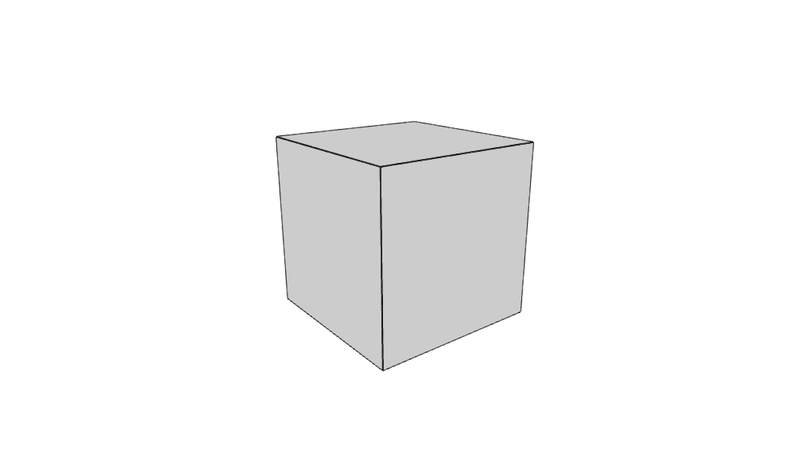

# primitive-box

[](http://github.com/badges/stability-badges)

A minimal box geometry for 3D rendering, NOT including normals, UVs.

Only vertices and cell indices (quad faces). As this geometry is not triangulated it's not ready for rendering you might need to use e.g. [geom-triangulate](https://www.npmjs.com/package/geom-triangulate).

You are probably looking for [primitive-cube](https://www.npmjs.com/package/primitive-cube). The difference is that cube has separate faces that can be textured while box does not. This is one solid mesh which makes it perfect for subdivisions.

## Usage

[](https://www.npmjs.com/package/primitive-box)

#### `mesh = createBox([sx, sy, sz])`

Parameters:  
`sx` - size x, defaults to 1  
`sy` - size y, defaults to `sx`  
`sz` - size z, defaults to `sx`

## Example

```javascript
var createBox = require('primtivie-box');
var box = createCreate(1);
```

`cube` will have the following structure:

```
{
  positions: [ [x, y, z], [x, y, z], ... ],
  cells: [ [a, b, c, d], [c, d, e, f], ... ],
}
```

## Demo

Download or clone this repo and run:

```
cd demo
npm install
npm start
```

## License

MIT, see [LICENSE.md](http://github.com/vorg/primitive-box/blob/master/LICENSE.md) for details.
